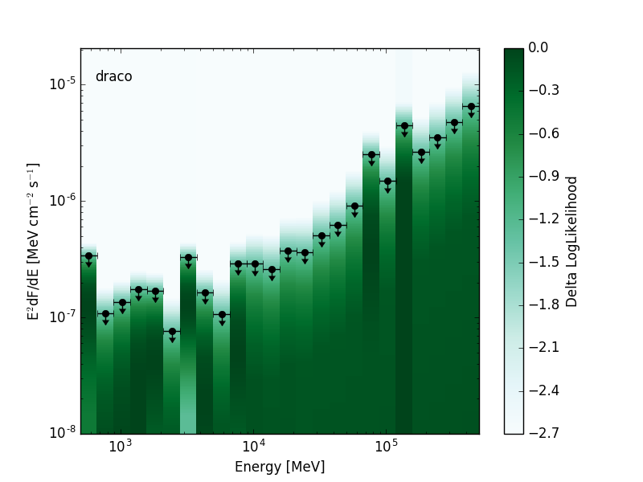
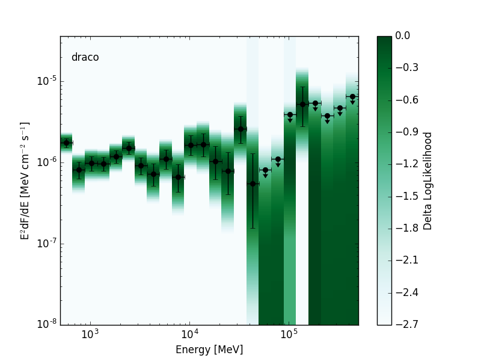

.. include:: ../../references.txt

.. _binned_likelihoods:

Binned Likelihood Profiles
==========================

This page describes formats for bin-by-bin likelihood profiles as
currently used in some LAT analyses.  The bin-by-bin likelihood
extends the concept of an SED by providing a representation of the
likelihood function in each energy bin.  :ref:`likelihood_sed` and
:ref:`likelihood_sed_cube` are two formats for serializing bin-by-bin
likelihoods to a FITS file.  A Likelihood SED stores the bin-by-bin
likelihood for a single source or test source position while a
Likelihood SED Cube stores a sequence of bin-by-bin likelihoods
(e.g. for a grid of positions or a group of sources).

In the following we describe some advantages and limitations of using
bin-by-bin likelihoods.  Relative to a traditonal SED, the bin-by-bin
likelihood retains more information about the shape of the likelihood
function around the maximum.  This can be important when working in
the low statistics regime where the likelihoods are non-Gaussian and a
flux value and one sigma uncertainty is insufficient to describe the
shape of the likelihood function.  Applications in which bin-by-bin
likelihoods may be useful include:

* Deriving upper limits on the global spectral distribution of a
  source.  Likelihood SEDs can be used to construct the likelihood
  function for arbitrary spectral models without recomputing the
  experimental likelihood function.  This is particularly useful for
  DM searches in which one tests a large number of spectral models
  (e.g. for mass and annihilation channel) and recomputing the
  experimental likelihood function for all models would be very
  expensive.  The bin-by-bin likelihoods are also a convenient way of
  distributing analysis results in a format that allows other spectral
  models to be easily tested.  The two of the most recent LAT
  publications on dSph DM searches have publicly released the analysis
  results in this format (see `2015PhRvL.115w1301A`_ and
  `2014PhRvD..89d2001A`_).

* Stacking analyses that combine measurements from multiple sources or
  multiple epochs of observation of a single source.  Forming a joint
  likelihood from the product of Likelihood SEDs fully preserves
  information in each data set and is equivalent to doing a joint fit
  as long as the data sets are independent.

* Analyses combining spectral measurements from multiple experiments.
  Likelihoods from two or more experiments can be multiplied to derive
  a joint likelihood function incorporating the measurements of each
  experiment.  As for stacking analyses, the joint likelihood approach
  avoids merging or averaging data or IRFs.  The bin-by-bin
  likelihoods further allow joint anlayses to be performed without
  having access to the data sets or tools that produced the original
  measurement.  For an application of this approach in the context of
  DM searches see `2016JCAP...02..039M`_.

There are a few important caveats to bin-by-bin likelihoods which may
limit their use for certain applications:

* Large correlations between the normalizations of two or more model
  components (e.g. when the spatial models are partially degenerate)
  can limit the utility of this approach.  Although such correlations
  can be accounted for by profiling the corresponding nuisance
  parameters, this may result in unphysical background models with
  large bin-to-bin fluctuations in the model amplitude.  One technique
  to avoid this issue (see `2015PhRvD..91j2001B`_ and
  `2016PhRvD..93f2004C`_) is to apply a Gaussian prior that constrains
  the spectral distribution of the background components to lie within
  a certain range of the global spectral model of that source
  (computed without the test source).
  
* Because the likelihoods in each energy bin are calculated
  independently, this technique cannot fully account for the influence
  of energy dispersion.  A first order correction can be obtained by
  scanning the likelihood with a spectral model (e.g. a power-law with
  index 2) that is close in shape to the spectral models that will be
  ultimately be tested.  However in analyses where the energy response
  matrix is particularly broad or non-diagonal the systematic errors
  arising from the approximate treatment of energy dispersion may
  exceed the statistical errors.  In LAT analyses energy dispersion
  can become significant effect when using data below 100 MeV (see
  `LAT_edisp_usage`_).  However when using an Index=2.0 and
  considering energies above 100 MeV, the spectral bias is less than
  3\% for models with indices between 1 and 3.5.
  

.. _likelihood_sed:

Likelihood SED
--------------

The likelihood SED is a representation of spectral energy distribution
of a source that contains a likelihood for the source normalization in
each energy bin.  Depending on the requirements of the analysis these
likelihoods can be evaluated with either profiled or fixed nuisance
parameters.  The likelihood SED can be used in the same way as a
traditional SED but contains additional information about the shape of
the likelihood function around the maximum.  A 2D visualization of the
likelihood functions can be produced by plotting a colormap in which
the intensity in each bin is mapped to the likelihood value:

   

+---------------------------------+---------------------------------+
| Low Significance Source         | High Significance Source        |
+=================================+=================================+
| |image0|                        | |image1|                        |
+---------------------------------+---------------------------------+

In the following we use *nebins* to designate the number of energy
bins and *nnorms* to designate the number of points in the
normalization scan.  The proposed format is a BINTABLE with one row
per energy bin containing the columns listed below.

The best-fit model amplitudes, errors, and upper limits are all
normalized to a reference spectral model.  The ``REF`` columns define
the amplitude of the reference model in different units.  The
reference model amplitudes are arbitrary and could for instance be set
to the best-fit amplitude in each energy bin.  ``NORM`` columns
contain the best-fit value, its errors, and upper limit in units of
the reference model amplitude.  Unit conversion of the ``NORM``
columns can be performed by doing a row-wise multiplication with the
respective ``REF`` column.

Sample FITS files:

* Low Significance Source: :download:`llsed_lowts.fits`
* High Significance Source: :download:`llsed_hights.fits`

Columns:

* ``E_MIN`` -- ndim: 1, unit: MeV
    * Dimension: nebins
    * Lower edge of energy bin.
* ``E_CTR`` -- ndim: 1, unit: MeV
    * Dimension: nebins
    * Center of energy bin.      
* ``E_MAX`` -- ndim: 1, unit: MeV
    * Dimension: nebins
    * Upper edge of energy bin.     
* ``REF_DFDE_E_MIN`` -- ndim: 1, unit: MeV^{-1} cm^{-2} s^{-1}
    * Dimension: nebins
    * Differential flux of reference model evaluated at the lower edge of the energy bin.
* ``REF_DFDE_E_MAX`` -- ndim: 1, unit: MeV^{-1} cm^{-2} s^{-1}
    * Dimension: nebins
    * Differential flux of reference model evaluated at the upper edge of the energy bin.
* ``REF_DFDE`` -- ndim: 1, unit: MeV^{-1} cm^{-2} s^{-1}
    * Dimension: nebins
    * Differential flux of reference model evaluated at the center of the energy bin.
* ``REF_EFLUX`` -- ndim: 1, unit: MeV cm^{-2} s^{-1}
    * Dimension: nebins
    * Energy flux of reference model integrated over the energy bin.
* ``REF_FLUX`` -- ndim: 1, unit: cm^{-2} s^{-1}
    * Dimension: nebins
    * Flux of reference model integrated over the energy bin.      
* ``REF_NPRED`` -- ndim: 1, unit: counts
    * Dimension: nebins
    * Number of predicted counts of reference model.
* ``NORM`` -- ndim: 1, unit: None
    * Dimension: nebins
    * Best-fit amplitude in units of the reference model amplitude.      
* ``NORM_ERR`` -- ndim: 1, unit: None
    * Dimension: nebins
    * Symmetric error on the source normalization in units of the reference model amplitude.  
* ``NORM_ERRP`` -- ndim: 1, unit: None, optional
    * Dimension: nebins
    * Positive error on the source normalization in units of the reference model amplitude.
* ``NORM_ERRN`` -- ndim: 1, unit: None, optional
    * Dimension: nebins
    * Negative error on the source normalization in units of the reference model amplitude.
* ``NORM_UL`` -- ndim: 1, unit: None, optional
    * Dimension: nebins
    * Upper limit on the source normalization in units of the reference model amplitude.
* ``NORM_SCAN`` -- ndim: 2, unit: None
    * Dimension: nebins x nnorms
    * Normalization scan values in each energy bin in units of the
      reference model amplitude.  Scan matrix can be multiplied by
      ``REF_EFLUX``, ``REF_FLUX``, ``REF_DFDE``, or ``REF_NPRED`` columns to get the
      normalization in the respective units.    
* ``TS`` -- ndim: 1, unit: counts
    * Dimension: nebins
    * Source test statistic as a function of energy bin.
* ``LOGLIKE`` -- ndim: 1, unit: None
    * Dimension: nebins 
    * Model LogLikelihood value for the best-fit normalization.      
* ``DLOGLIKE_SCAN`` -- ndim: 2, unit: None
    * Dimension: nebins x nnorms
    * Delta LogLikelihood value vs. normalization.  The
      Delta-Loglikelihood is evaluated with respect to the maximum of
      the likelihood function in each energy bin as given in the
      ``LOGLIKE`` column.

.. _likelihood_sed_cube:
      
Likelihood SED Cube
-------------------

The Likelihood SED Cube is format for storing a sequence of Likelihood
SEDs in a single table.  Table rows can be mapped to individual
sources, spatial pixels, or observations epochs.  In the following we
use *nrows* to designate table rows, *nebins* to designate the number
of energy bins and *nnorms* to designate the number of points in the
normalization scan.

Sample FITS files:

* Low Significance Source: :download:`llsedcube_lowts.fits`
* High Significance Source: :download:`llsedcube_hights.fits`

Columns:
  
* ``DLOGLIKE_SCAN`` -- ndim: 3, unit: None
    * Dimension: nrows x nebins x nnorms
    * Delta-LogLikelihood value vs. normalization.  The
      Delta-Loglikelihood is evaluated with respect to the maximum of
      the likelihood function in each energy bin as given in the
      ``LOGLIKE`` column.
* ``NORM_SCAN`` -- ndim: 3, unit: None
    * Dimension: nrows x nebins x nnorms
    * Normalization values for the test source in units of the reference model amplitude.
* ``E_MIN`` --  ndim: 2, unit: keV
    * Dimension: nrows x nebins
    * Lower edge of energy bin.
* ``E_CTR`` -- ndim: 2, unit: keV
    * Dimension: nrows x nebins
    * Center of energy bin.
* ``E_MAX`` -- ndim: 2, unit: keV
    * Dimension: nrows x nebins
    * Upper edge of energy bin.
* ``REF_DFDE_E_MIN`` -- ndim: 2, unit: MeV^{-1} cm^{-2} s^{-1}
    * Dimension: nrows x nebins
    * Differential flux of reference model evaluated at the lower edge of the energy bin.
* ``REF_DFDE_E_MAX`` -- ndim: 2, unit: MeV^{-1} cm^{-2} s^{-1}
    * Dimension: nrows x nebins
    * Differential flux of reference model evaluated at the upper edge of the energy bin.
* ``REF_DFDE`` -- ndim: 2, unit: MeV^{-1} cm^{-2} s^{-1}
    * Dimension: nrows x nebins
    * Differential flux of reference model evaluated at the center of the energy bin.
* ``REF_EFLUX`` -- ndim: 2, unit: MeV cm^{-2} s^{-1}
    * Dimension: nrows x nebins
    * Energy flux of reference model integrated over the energy bin.
* ``REF_FLUX`` -- ndim: 2, unit: cm^{-2} s^{-1}
    * Dimension: nrows x nebins
    * Flux of reference model integrated over the energy bin.      
* ``REF_NPRED`` -- ndim: 2, unit: counts, optional
    * Dimension: nrows x nebins
    * Number of predicted counts of reference model.
* ``NORM`` -- ndim: 2, unit: None
    * Dimension: nebins
    * Best-fit amplitude in units of the reference model amplitude.       
* ``NORM_ERR`` -- ndim: 2, unit: None
    * Dimension: nrows x nebins
    * Symmetric error on the source normalization in units of the reference model amplitude.  
* ``NORM_ERRP`` -- ndim: 2, unit: None, optional
    * Dimension: nrows x nebins
    * Positive error on the source normalization in units of the reference model amplitude.
* ``NORM_ERRN`` -- ndim: 2, unit: None, optional
    * Dimension: nrows x nebins
    * Negative error on the source normalization in units of the reference model amplitude.
* ``NORM_UL`` -- ndim: 2, unit: None, optional
    * Dimension: nrows x nebins      
    * Upper limit on the source normalization in units of the
      reference model amplitude.  Confidence level of upper limit is
      saved to the ``UL_CONFIDENCE`` keyword of the FITS header.  If
      no confidence level is defined a default of 95% should be
      assumed.
* ``TS`` -- ndim: 2, unit: counts
    * Dimension: nrows x nebins
    * Source test statistic as a function of energy bin.
* ``LOGLIKE`` -- ndim: 2, unit: None
    * Dimension: nrows x nebins 
    * Model LogLikelihood value evaluated at the normalization MLE.

.. _tscube:

TSCube Output Format
--------------------

Recent releases of the Fermi ScienceTools provide a *gttscube*
application that fits a test source on a grid of spatial positions
within the ROI.  At each test source position this tool calculates the
following information:

* TS and best-fit amplitude of the test source.  
* A likelihood SED.

The output of the tool is a FITS file containing maps that encode the
fit results.  The PRIMARY HDU contains the same output as *gttsmap* --
a 2-dimensional map with the test source TS evaluated at each
position.  The primary fit results are contained in the following
BINTABLE HDUs:

* ``SCANDATA`` : A :ref:`likelihood_sed_cube` containing likelihood
  SEDs at each spatial pixel.

* ``FITDATA`` : A table containing fit results for the reference model
  at each spatial pixel over the full energy range.

Following the usual FITS convention both tables use columnwise
ordering for mapping rows to pixel indices.  The other HDUs contain
the fit results information as IMAGE HDUs for visualization.

Sample FITS files:

* Low Significance Source: :download:`tscube_lowts.fits`

Here is the list of HDUs:

.. csv-table:: TS Cube HDUs
   :header:    HDU, HDU Type, HDU Name, Dimensions, Description
   :file: tscube_hdus.csv
   :delim: |
   :widths: 10,10,10,10,80

The EBOUNDS HDU is a BINTABLE with 1 row per energy bin and the following
columns:

* ``E_MIN``, unit: keV
    * Lower edge of energy bin.
* ``E_CTR``, unit: keV
    * Center of energy bin.
* ``E_MAX``, unit: keV
    * Upper edge of energy bin.
* ``REF_DFDE_E_MIN`` -- ndim: 1, unit: MeV^{-1} cm^{-2} s^{-1}
    * Dimension: nebins
    * Differential flux of reference model evaluated at the lower edge of the energy bin.
* ``REF_DFDE_E_MAX`` -- ndim: 1, unit: MeV^{-1} cm^{-2} s^{-1}
    * Dimension: nebins
    * Differential flux of reference model evaluated at the upper edge of the energy bin.
* ``REF_DFDE`` -- ndim: 1, unit: MeV^{-1} cm^{-2} s^{-1}
    * Dimension: nebins
    * Differential flux of reference model evaluated at the center of the energy bin.
* ``REF_EFLUX`` -- ndim: 1, unit: MeV cm^{-2} s^{-1}
    * Dimension: nebins
    * Energy flux of reference model integrated over the energy bin.
* ``REF_FLUX`` -- ndim: 1, unit: cm^{-2} s^{-1}
    * Dimension: nebins
    * Flux of reference model integrated over the energy bin.      
* ``REF_NPRED`` -- ndim: 1, unit: counts, optional
    * Dimension: nebins
    * Number of predicted counts of reference model.
        
The FITDATA HDU is a BINTABLE with 1 row per spatial pixel (*nrows*)
and the following columns.  
      
* ``NORM`` -- ndim: 1, unit: None
    * Dimension: nrows
    * Best-fit normalization for the global model in units of the reference model amplitude.       
* ``NORM_ERR`` -- ndim: 1, unit: None
    * Dimension: nsbins 
    * Symmetric error on the global model normalization in units of the reference model amplitude.  
* ``NORM_ERRP`` -- ndim: 1, unit: None, optional
    * Dimension: nsbins 
    * Positive error on the global model normalization in units of the reference model amplitude.
* ``NORM_ERRN`` -- ndim: 1, unit: None, optional
    * Dimension: nsbins 
    * Negative error on the global model normalization in units of the reference model amplitude.
* ``NORM_UL`` -- ndim: 1, unit: None, optional
    * Dimension: nsbins 
    * Upper limit on the global model normalization in units of the reference model amplitude.
* ``TS`` -- ndim: 1, unit: None, optional
    * Dimension: nsbins 
    * Test statistic of the best-fit global model.
