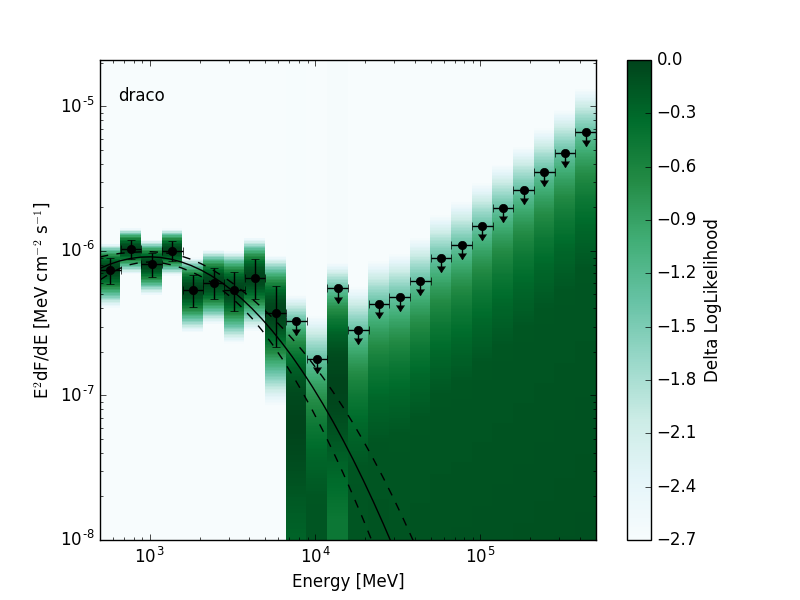

.. include:: ../../references.txt

.. _binned_likelihoods:

Bin-by-bin Likelihood Profiles
******************************

This page describes formats for bin-by-bin likelihood profiles as
currently used in some LAT analyses.  The bin-by-bin likelihood
extends the concept of an SED by providing a representation of the
likelihood function in each energy bin.  :ref:`likelihood_sed` and
:ref:`likelihood_sed_cube` are two formats for serializing bin-by-bin
likelihoods to a FITS file.  A Likelihood SED stores the bin-by-bin
likelihood for a single source or test source position while a
Likelihood SED Cube stores a sequence of bin-by-bin likelihoods
(e.g. for a grid of positions or a group of sources).

In the following we describe some advantages and limitations of using
bin-by-bin likelihoods.  Relative to a traditonal SED, the bin-by-bin
likelihood retains more information about the shape of the likelihood
function around the maximum.  This can be important when working in
the low statistics regime where the likelihoods are non-Gaussian and a
flux value and one sigma uncertainty is insufficient to describe the
shape of the likelihood function.  Applications in which bin-by-bin
likelihoods may be useful include:

* Deriving upper limits on the global spectral distribution of a
  source.  Likelihood SEDs can be used to construct the likelihood
  function for arbitrary spectral models without recomputing the
  experimental likelihood function.  This is particularly useful for
  DM searches in which one tests a large number of spectral models
  (e.g. for mass and annihilation channel) and recomputing the
  experimental likelihood function for all models would be very
  expensive.  The bin-by-bin likelihoods are also a convenient way of
  distributing analysis results in a format that allows other spectral
  models to be easily tested.  The two of the most recent LAT
  publications on dSph DM searches have publicly released the analysis
  results in this format (see `2015PhRvL.115w1301A`_ and
  `2014PhRvD..89d2001A`_).

* Stacking analyses that combine measurements from multiple sources or
  multiple epochs of observation of a single source.  Forming a joint
  likelihood from the product of Likelihood SEDs fully preserves
  information in each data set and is equivalent to doing a joint fit
  as long as the data sets are independent.

* Analyses combining spectral measurements from multiple experiments.
  Likelihoods from two or more experiments can be multiplied to derive
  a joint likelihood function incorporating the measurements of each
  experiment.  As for stacking analyses, the joint likelihood approach
  avoids merging or averaging data or IRFs.  The bin-by-bin
  likelihoods further allow joint anlayses to be performed without
  having access to the data sets or tools that produced the original
  measurement.  For an application of this approach in the context of
  DM searches see `2016JCAP...02..039M`_.

There are a few important caveats to bin-by-bin likelihoods which may
limit their use for certain applications:

* Large correlations between the normalizations of two or more model
  components (e.g. when the spatial models are partially degenerate)
  can limit the utility of this approach.  Although such correlations
  can be accounted for by profiling the corresponding nuisance
  parameters, this may result in unphysical background models with
  large bin-to-bin fluctuations in the model amplitude.  One technique
  to avoid this issue (see `2015PhRvD..91j2001B`_ and
  `2016PhRvD..93f2004C`_) is to apply a Gaussian prior that constrains
  the spectral distribution of the background components to lie within
  a certain range of the global spectral model of that source
  (computed without the test source).
  
* Because the likelihoods in each energy bin are calculated
  independently, this technique cannot fully account for bin-to-bin
  correlations caused by energy dispersion.  The effect of energy
  dispersion can be corrected to first order by scanning the
  likelihood with a spectral model (e.g. a power-law with index 2)
  that is close in shape to the spectral models of interest.  However
  in analyses where the energy response matrix is particularly broad
  or non-diagonal the systematic errors arising from the approximate
  treatment of energy dispersion may exceed the statistical errors.
  In LAT analyses energy dispersion can become a significant effect when
  using data below 100 MeV (see `LAT_edisp_usage`_).  However when
  using an Index=2.0 and considering energies above 100 MeV, the
  spectral bias is less than 3\% for models with indices between 1 and
  3.5.
  

.. _likelihood_sed:

Likelihood SED
==============

The likelihood SED is a representation of spectral energy distribution
of a source that contains a likelihood for the source normalization in
each energy bin.  Depending on the requirements of the analysis these
likelihoods can be evaluated with either profiled or fixed nuisance
parameters.  The likelihood SED can be used in the same way as a
traditional SED but contains additional information about the shape of
the likelihood function around the maximum.  A 2D visualization of the
likelihood functions can be produced by creating a colormap in which
the intensity is mapped to the likelihood value:

.. |image0| image:: llsed_lowts.png
   :width: 100%
   

+---------------------------------+---------------------------------+
| Low Significance Source         | High Significance Source        |
+=================================+=================================+
| |image0|                        | |image1|                        |
+---------------------------------+---------------------------------+

In the following we use *nebins* to designate the number of energy
bins and *nnorms* to designate the number of points in the
normalization scan.  The proposed format is a BINTABLE with one row
per energy bin containing the columns listed below.

The best-fit model amplitudes, errors, and upper limits are all
normalized to a reference spectral model.  The ``ref`` columns define
the amplitude of the reference model in different units.  The
reference model amplitudes are arbitrary and could for instance be set
to the best-fit amplitude in each energy bin.  ``norm`` columns
contain the best-fit value, its errors, and upper limit in units of
the reference model amplitude.  Unit conversion of the ``norm``
columns can be performed by doing a row-wise multiplication with the
respective ``ref`` column.

Sample FITS files:

* Low Significance Source: :download:`llsed_lowts.fits`
* High Significance Source: :download:`llsed_hights.fits`

Header Keywords
---------------

* ``SED_TYPE``
    * SED type string.  Should be set to ``likelihood``.
* ``UL_CONF``, **optional**
    * Confidence level of the upper limit (range: 0 to 1) of the value in the ``norm_ul`` column.
      
Columns
-------

The columns listed here are a subset of the columns defined in the
:ref:`flux-points` format.  See :ref:`sed_columns` for the full column
specifications.

Required Columns
~~~~~~~~~~~~~~~~

* ``e_min`` -- ndim: 1, Dimension: nebins
* ``e_max`` -- ndim: 1, Dimension: nebins
* ``e_ref`` -- ndim: 1, Dimension: nebins
* ``ref_dnde`` -- ndim: 1, Dimension: nebins
* ``ref_eflux`` -- ndim: 1, Dimension: nebins
* ``ref_flux`` -- ndim: 1, Dimension: nebins
* ``ref_npred`` -- ndim: 1, Dimension: nebins
* ``norm`` -- ndim: 1, Dimension: nebins
* ``norm_err`` -- ndim: 1, Dimension: nebins
* ``norm_scan`` -- ndim: 2, Dimension: nebins x nnorms
* ``ts`` -- ndim: 1, Dimension: nebins
* ``loglike`` -- ndim: 1, Dimension: nebins
* ``dloglike_scan`` -- ndim: 2, Dimension: nebins x nnorms

Optional Columns
~~~~~~~~~~~~~~~~

* ``ref_dnde_e_min`` -- ndim: 1, Dimension: nebins
* ``ref_dnde_e_max`` -- ndim: 1, Dimension: nebins
* ``norm_errp`` -- ndim: 1, Dimension: nebins
* ``norm_errn`` -- ndim: 1, Dimension: nebins
* ``norm_ul`` -- ndim: 1, Dimension: nebins

.. _likelihood_sed_cube:
      
Likelihood SED Cube
===================

The Likelihood SED Cube is format for storing a sequence of Likelihood
SEDs in a single table.  The format defines a file with two BINTABLE
HDUs: :ref:`SCANDATA <scandata>` and :ref:`EBOUNDS <ebounds>`.
SCANDATA has one row per Likelihood SED while EBOUNDS has one row per
energy bin.  Table rows in SCANDATA can be mapped to a list of
sources, spatial pixels, or observations epochs.  Because the row
mapping is not defined by the format itself additional columns can be
added to SCANDATA that defined the mapping of each row.  Examples
would be columns for source name designation, pixel coordinate, or
observation epoch.

In the following we use *nrows* to designate table rows, *nebins* to
designate the number of energy bins and *nnorms* to designate the
number of points in the normalization scan.  As for the Likelihood SED
format, columns that contain ``norm`` are expressed in units of the
reference model amplitude.  These can be multiplied by ``ref_eflux``,
``ref_flux``, ``ref_dnde``, or ``ref_npred`` columns in the EBOUNDS
HDU to get the normalization in the respective units.

Sample FITS files:

* Low Significance Source: :download:`tscube_lowts.fits`
* High Significance Source: :download:`tscube_hights.fits`

.. _scandata:

SCANDATA Table
--------------

The SCANDATA HDU is a BINTABLE with the following columns.  The
columns listed here are a subset of the columns in the
:ref:`flux-points` format.  Relative to the 1D SED formats
the dimensionality of all columns is increased by one with the first
dimension (rows) mapping to spatial pixels.  See :ref:`sed_columns`
for the full column specifications.

Header Keywords
~~~~~~~~~~~~~~~

* ``UL_CONF``, **optional**
    * Confidence level of the upper limit given in the ``norm_ul`` column.

Required Columns
~~~~~~~~~~~~~~~~

* ``dloglike_scan`` -- ndim: 3, Dimension: nrows x nebins x nnorms
* ``norm_scan`` -- ndim: 3, Dimension: nrows x nebins x nnorms
* ``norm`` -- ndim: 2, Dimension: nrows x nebins
* ``norm_err`` -- ndim: 2, Dimension: nrows x nebins
* ``ts`` -- ndim: 2, Dimension: nrows x nebins
* ``loglike`` -- ndim: 2, Dimension: nrows x nebins 

Optional Columns
~~~~~~~~~~~~~~~~

* ``ref_npred`` -- ndim: 2, Dimension: nrows x nebins
* ``norm_errp`` -- ndim: 2, Dimension: nrows x nebins
* ``norm_errn`` -- ndim: 2, Dimension: nrows x nebins
* ``norm_ul`` -- ndim: 2, Dimension: nrows x nebins      
* ``bin_status`` -- ndim: 2, unit: None
    * Dimension: nrows x nebins
    * Fit status code. 0 = OK, >0 = Not OK
      
.. _ebounds:

EBOUNDS Table
-------------

The EBOUNDS HDU is a BINTABLE with 1 row per energy bin and the
following columns.  The columns listed here are a subset of the
columns in the :ref:`flux-points` format.  See :ref:`sed_columns` for
the full column specifications.  Note that for backwards compatibility
with existing EBOUNDS table convention (e.g. as used for WCS counts
cubes) columns names are upper case.

Required Columns
~~~~~~~~~~~~~~~~

* ``E_MIN``, unit: keV, Dimension: nebins
* ``E_REF``, unit: keV, Dimension: nebins
* ``E_MAX``, unit: keV, Dimension: nebins
* ``REF_DNDE`` -- ndim: 1, Dimension: nebins
* ``REF_EFLUX`` -- ndim: 1, Dimension: nebins
* ``REF_FLUX`` -- ndim: 1, Dimension: nebins

Optional Columns
~~~~~~~~~~~~~~~~
* ``REF_DNDE_E_MIN`` -- ndim: 1, Dimension: nebins
* ``REF_DNDE_E_MAX`` -- ndim: 1, Dimension: nebins
* ``REF_NPRED`` -- ndim: 1, Dimension: nebins

.. _tscube:

TSCube Output Format
====================

Recent releases of the Fermi ScienceTools provide a *gttscube*
application that fits a test source on a grid of spatial positions
within the ROI.  At each test source position this tool calculates the
following information:

* TS and best-fit amplitude of the test source.  
* A likelihood SED.

The output of the tool is a FITS file containing a Likelihood SED Cube
with *nrows* in which each table row maps to a pixel in the grid scan.
The PRIMARY HDU contains the same output as *gttsmap* -- a
2-dimensional FITS IMAGE with the test source TS evaluated at each
position.  The primary fit results are contained in the following
BINTABLE HDUs:

* A :ref:`scandata` containing the likelihood SEDs for each spatial pixel.
* A :ref:`fitdata` containing fit results for the reference model at each spatial pixel over the full energy range.
* A :ref:`ebounds` containing the bin definitions and the amplitude of the reference model.

The mapping of rows to pixels is defined by the WCS header keywords in
the SCANDATA HDU.  Following the usual FITS convention both tables
use columnwise ordering for mapping rows to pixel indices.  

Here is the list of HDUs:

.. csv-table:: TS Cube HDUs
   :header:    HDU, HDU Type, HDU Name, Description
   :file: tscube_hdus.csv
   :delim: |
   :widths: 10,10,10,80

.. _fitdata:

FITDATA Table
-------------
            
The FITDATA HDU is a BINTABLE with 1 row per spatial pixel (*nrows*)
and the following columns:

* ``fit_norm`` -- ndim: 1, unit: None
    * Dimension: nrows
    * Best-fit normalization for the global model in units of the reference model amplitude.       
* ``fit_norm_err`` -- ndim: 1, unit: None
    * Dimension: nrows 
    * Symmetric error on the global model normalization in units of the reference model amplitude.  
* ``fit_norm_errp`` -- ndim: 1, unit: None
    * Dimension: nrows 
    * Positive error on the global model normalization in units of the reference model amplitude.
* ``fit_norm_errn`` -- ndim: 1, unit: None
    * Dimension: nrows 
    * Negative error on the global model normalization in units of the reference model amplitude.
* ``fit_norm_ul`` -- ndim: 1, unit: None
    * Dimension: nrows 
    * Upper limit on the global model normalization in units of the reference model amplitude.
* ``fit_ts`` -- ndim: 1, unit: None
    * Dimension: nrows 
    * Test statistic of the best-fit global model.
* ``fit_status`` -- ndim: 1, unit: None
    * Dimension: nrows 
    * Status code for the fit. 0 = OK, >0 = Not OK
